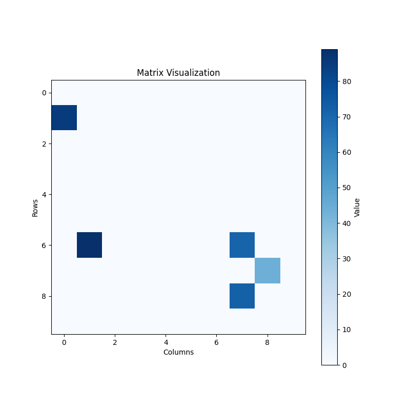
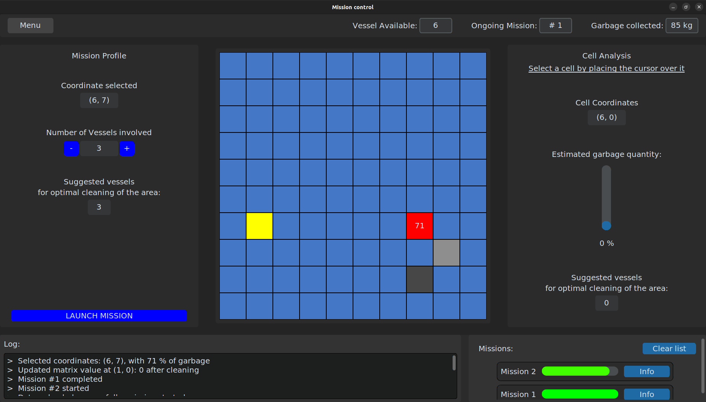

# Distributed Control Project

## Overview
This is my part of a project for the Distributed Control Systems course at the University of Modena and Reggio Emilia (UNIMORE). 

The goal is to program heterogenous agents (drones, vessels and motherboard), for moving in an obstacle presence environment and perform task exploiting distributed control. In a human centric approach the control room is simulated via a custom GUI.

## Technical Skills

Distributed algorithms are used to control the formation and coverage of the agents:
- Formation Control: Consensus algorithm is used to control the formation of the agents.
- Coverage Control: Voronoi algorithm is used to control the coverage of the agents.

Creation of custom graphical user interface (GUI). (`customtkinter` is an enhanced version of the standard Tkinter library.)

OOP paradigm (Object-Oriented Programming) is used to ensure modularity and scalability of the codebase. 

## Folder Structure

The repository contain: 
- the map generator
- custom interface
- formation control
- coverage control
- path planning for the motherboat

### 1. `map_generator`
This folder contains the code to create a matrix that defines a map with a fixed seed. It generates both a plot and a JSON file that can be shared with other applications. The generated files are saved within this folder.

### 2. `interface`
This folder contains the custom interface built using `customtkinter`. It provides a user-friendly interface to interact with the distributed control system.

### 3. `formation`
This folder contains the script [formation_control.py](formation/formation_control.py) which controls the formation of a team of robots. The robots are controlled to maintain a specific formation while navigating through a given space, using consensus algorithm. 
The positions are updated and visualized in real-time using Matplotlib's FuncAnimation.

### 4. `coverage`
This folder contains the script [voronoi_vessel_print.py](coverage/voronoi_vessel_print.py) which runs a simulation of a team of vessels using the Voronoi algorithm. The robots update their positions based on the Voronoi algorithm with Gaussian weights centered at a target position.
The positions are updated and visualized in real-time using Matplotlib's FuncAnimation.

### 5. `move_motherboat`
This folder contains the script [motherboat_w-obstacle.py](move_motherboat/motherboat_w-obstacle.py) which computes the path for the motherboat to follow using the A* algorithm with obstacle avoidance. The path is then smoothed using spline interpolation to ensure a smooth trajectory.
The positions are updated and visualized in real-time using Matplotlib's FuncAnimation.

## Author 
Leonardo Brighenti 